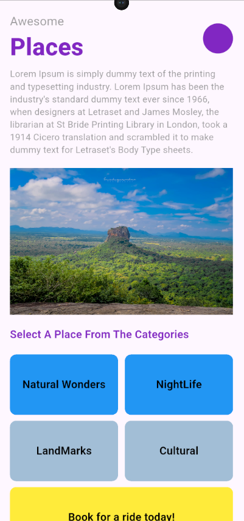
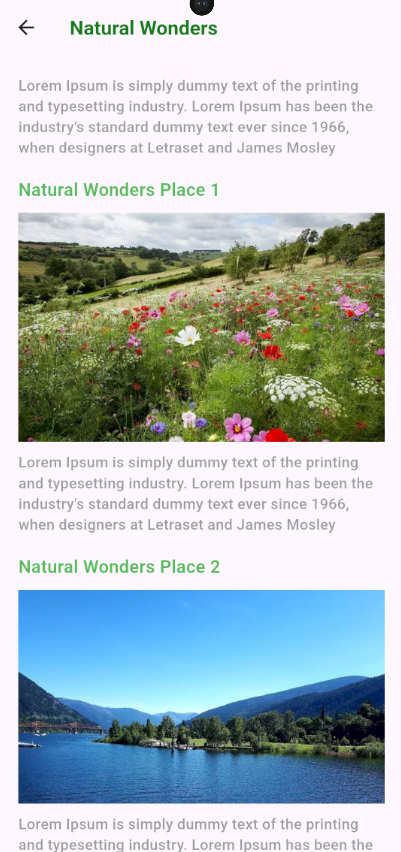
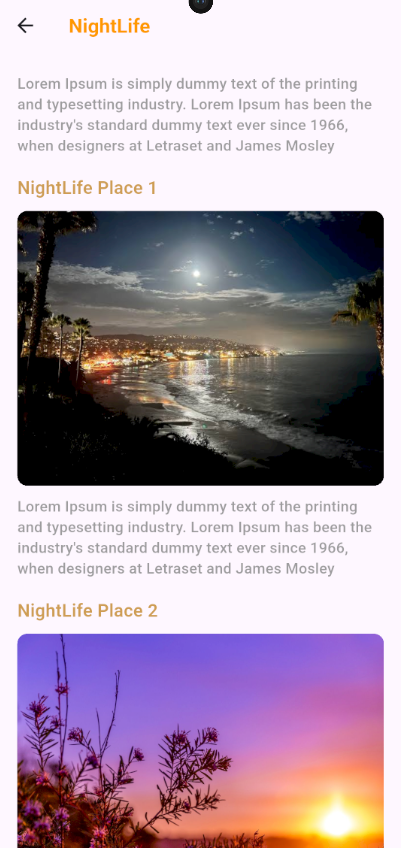
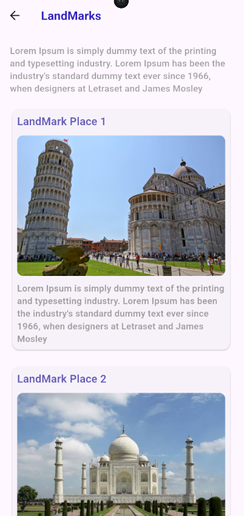
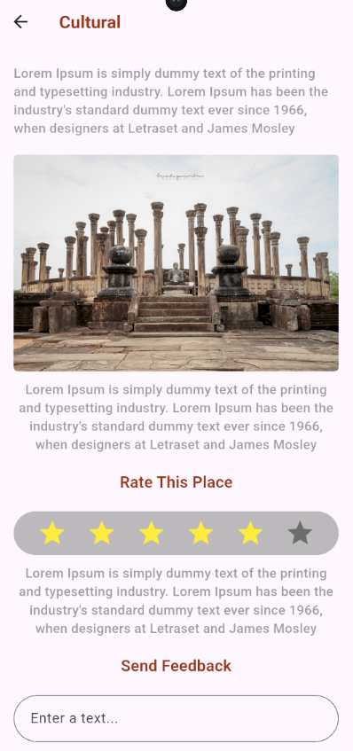
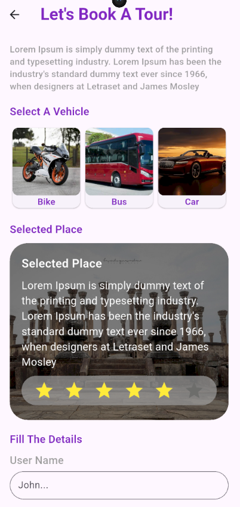

# Awesome Places - Basic Mobile Application 📱

A foundational mobile application developed as part of the **Flutter Series** by **DP Education IT Campus**. This project demonstrates core Flutter and Dart concepts, clean UI structuring, and effective state management for building interactive mobile user interfaces.

## 🌟 Acknowledgments & Credits

A special thanks to **DP Education IT Campus** and their comprehensive **Flutter Series**. The guidance, tutorials, and concepts taught throughout the series provided the fundamental knowledge and technical foundation required to build and structure this mobile application successfully.

---

## 🚀 Features
* Clean and responsive user interface built with Flutter widgets.
* Well-structured navigation and page routing (`home`, `bookings`, `cultural`, `natural_wonders`, `night_life`, etc.).
* Custom reusable components, cards, and buttons for a consistent design system.
* Optimized assets and layout structures designed for mobile platforms.

---

## 🛠️ Tech Stack
* **Framework:** [Flutter](https://flutter.dev/)
* **Language:** [Dart](https://dart.dev/)
* **IDE:** Visual Studio Code / Android Studio

---

## 📂 Project Structure Highlights

lib/
│
├── pages/           # Application screens (Bookings, Cultural, home_page, land_mark, natural_wonders, night_life)
├── utils/           # color palettes
├── utils/           # Utility files, color palettes, and global constants
└── widgets/home     # category_card
├── widgets/resuble  # custome_button, image_card, landmark_card, star_box, vehicle_card
├── main.dart

---

## 📸 App Screenshots

  
  
  
  
  
  

